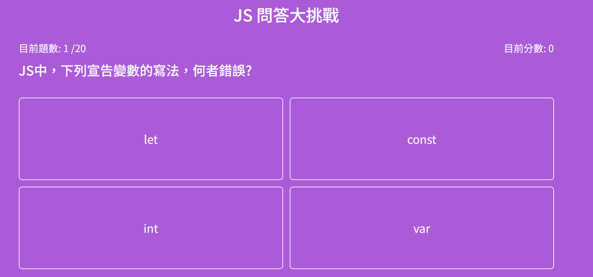

## React 選擇題小遊戲



## 安裝

Node.js 版本建議為：v20.10.0

### 取得專案

```
git clone https://github.com/tim8076/JS-question-game.git
```

### 移動到專案內

```
cd JS-question-game
```

### 安裝

```
npm install
```

### 運行專案

```
npm run dev
```

## 資料夾說明

- assets - 靜態資源放置處
  scss - scss 檔案放置處
  images - 圖片放置處
- components - react 元件放置處
- data - 遊戲資料放置處

## 專案技術

- Node.js v20.10.0
- React v18.3.1
- Bootstrap v5.3.3
